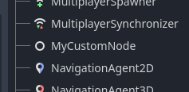

# GDExtension Util


## What is this?

A reference repository that documents Godot's GDExtension API and provides some C boilerplate. This repository was created because I was making [3starblaze/godot-clojure](https://github.com/3starblaze/godot-clojure). GDExtension docs were rather sparse but nonetheless I needed to have a good grasp over the API.

I want to thank all the good folks at Godot Café discord server who helped me fill the gaps. Special thanks to [godotengine/godot-docs PR#8751](https://github.com/godotengine/godot-docs/pull/8751) that has a sweet tutorial on using GDExtension via C.

Currently README is composed from 2 parts:

- Glossary -- explanation of terms that you will encounter when working with GDExtension
- Documentation -- a tutorial that gradually introduces you to GDExtension concepts and which will teach you how to make a custom Node class that you can use in editor just like regular Godot nodes.

In distant future there should be a guide on how to make a custom `Script` (like `GDScript` or `CSharpScript`). In short, you need to make a custom class implementation for `ScriptExtension` and `ScriptLanguageExtension`.

Also, there's probably going to be some boilerplate that adds some safety to FFI API. If you have gone through tutorial documentation, you will notice how common void pointers are. While typing all object types is a bit too much work, in future we could add such potential additions as

- autogenerated `gde-header` function struct definition
- types, constructors and destructors for "built-in classes"
- generated and typed Variant wrapping and unwrapping

## Glossary

- (function/method) hash -- a unique unsigned integer that represents the function/method signature

- placeholder script instance -- a script instance that only runs in editor and not during the game

- `ptrcall` method -- a method that operates on raw types (such as doubles, ints) which are not wrapped in Variant

- utility function -- a function that is defined in [@GlobalScope](https://docs.godotengine.org/en/stable/classes/class_@globalscope.html)

## Documentation

### Introduction

In order to make the integration, you should familiarize yourself with two files `gde-header` (`godot-headers/gdextension_interface.h`) and `gde-api` (`godot-headers/extension_api.json`). `gde-header` lists all sorts of types that are mostly unique to Godot + C interop. `gde-api` mostly describes the regular Godot API that is used for game development. 

Everything begins when Godot calls a function that matches the `GDExtensionInitializationFunction` type. `gde-header` offers some explanation about this function. In order to begin writing the C code, we will import the header and define the entry function as `godot_entry`.

```c
#include "../godot-headers/gdextension_interface.h"

GDExtensionBool
godot_entry(
  GDExtensionInterfaceGetProcAddress p_get_proc_address,
  const GDExtensionClassLibraryPtr p_library,
  GDExtensionInitialization *r_initialization
) {

}
```

First we need to understand all three parameters, in order to understand how we can tell Godot what needs to be done. 

The first parameter `p_get_proc_address` is a function that takes a `const char *p_function_name` and returns a function. This function is the only way to interact with Godot because `gde-header` doesn't list any functions that can be called, it's just typedefs. If you search for `@name` in `gde-header`, you will see several *special* function typedefs that have docblocks. Those are public functions you can call but first you have to retrieve them via `p_get_proc_address`.

The second parameter `p_library` is mostly used for defining custom classes that will appear in Godot once your C library is loaded.

The third parameter, `r_initialization` is used to configure initialization. Let's look inside `gde-header`.
```c
// ...
typedef enum {
	GDEXTENSION_INITIALIZATION_CORE,
	GDEXTENSION_INITIALIZATION_SERVERS,
	GDEXTENSION_INITIALIZATION_SCENE,
	GDEXTENSION_INITIALIZATION_EDITOR,
	GDEXTENSION_MAX_INITIALIZATION_LEVEL,
} GDExtensionInitializationLevel;

typedef struct {
	/* Minimum initialization level required.
	 * If Core or Servers, the extension needs editor or game restart to take effect */
	GDExtensionInitializationLevel minimum_initialization_level;
	/* Up to the user to supply when initializing */
	void *userdata;
	/* This function will be called multiple times for each initialization level. */
	void (*initialize)(void *userdata, GDExtensionInitializationLevel p_level);
	void (*deinitialize)(void *userdata, GDExtensionInitializationLevel p_level);
// ...
```

Once Godot starts, it initializes in layers, first core, second servers, third scene and finally editor (if the editor is loaded). These initialization layers roughly correspond to those in [Godot's architecture diagram](https://docs.godotengine.org/en/stable/contributing/development/core_and_modules/godot_architecture_diagram.html) page. 


If you don't know what to choose, you only need to care about *scene* (which is always loaded) or *editor* (which is only loaded when the editor is loaded). Set `r_initialization`'s `initialize` and `deinitialize`, compare the `p_level` to `GDEXTENSION_INITIALIZATION_SCENE` or `GDEXTENSION_INITIALIZATION_SCENE` and do the work. If you don't wait for initialization (for example, you want to do your work in the entry function) then Godot classes cannot be used and you will encounter `ERROR: Cannot get class 'Node'.` or similar.

With this knowledge you can make a simple "Hello world" program that will be called when a Godot project is loaded. Once you compile `hello_gdextension.c` and run the minimal project, you can see print statements "hello from scene!" and "hello from editor!" which means that everything works as expected! If you close Godot normally (and don't terminate with `Ctrl-C`), you will see "goodbye from editor!" and "goodbye from scene!". 

```bash
./build.py src/hello_gdextension.c # Build the first example
godot mvp-godot-project/project.godot # Open the project
```

### Hello `p_get_proc_address`

`src/hello_p_get_proc_address.c` contains a simple usage of `p_get_process_address` in order to retrieve the current version of Godot.

```bash
./build.py src/hello_p_get_proc_address.c
godot mvp-godot-project/project.godot
```

### Hello global Godot function

`src/hello_global_godot_function.c` shows how you can call a Godot function that is defined in the global scope. You can find documentation in [@GlobalScope](https://docs.godotengine.org/en/stable/classes/class_%40globalscope.html). In our program we have chosen to call `rad_to_deg`. While it's not worth the effort to call this particular function because the formula is as simple as `rad * 180 / PI`, it's perfect for demonstration purposes because we can quickly tell if the function output is correct.

This example introduces several new concepts and thus is noticeably larger.

First of all, to keep our sanity, we have made a `gd_extension` structure that holds the global API functions. Keeping functions in a struct lets our function calls look like they belong in a namespace, e.g. `gd_extension.string_name_new_with_utf8_chars(res, c_string)`, which makes code more readable. 

Secondly, @GlobalScope functions are called **utility functions** in GDExtension and the function signatures are found in `gde-api`'s `utility_functions` field. An important concept to keep in mind is the notion of function/method signature **hash** which uniquely identifies a signature. It doesn't seem to be an important concept in global functions but there are several classes in Godot with methods that can have optional arguments or several signatures. In practical terms, if we want to call a function/method, we need to specify both *name* and *hash* which you can see in `gd_extension.variant_get_ptr_utility_function(rad_to_deg_string_name, 2140049587);`.

Thirdly, you are greeted with `StringName` which appears rather often in GDExtension. You can read [StringName documentation](https://docs.godotengine.org/en/stable/classes/class_stringname.html) in the official docs but the main idea is that StringName comparisons are really fast and the rule of thumb is that if you want to specify a class, property or anything else that needs to be found via string, it's going to be to a StringName. 

GDExtension provides a convenience function `string_name_with_utf8_chars` that can turn a regular C string into `StringName`. If we take a look at our convenience function `construct_string_name`, we see that the size depends on whether the Godot is built for 64bit (which it is). In order to figure out, how many bytes are needed, we need to look inside `gde-api`'s `builtin_class_sizes`. There are 4 build configurations: `float_32`, `float_64`, `double_32`, `double_64` which respectively correspond to regular 32-bit, regular 64-bit, large world coordinate 32-bit, large world coordinate 64bit. If we inspect the size of `StringName`, we get 4, 8, 4, 8 which means that the StringName size only depends on bit width. By default Godot is in `float_64` configuration and you would need to build other configurations separately. You may want to read [Large world coordinates](https://docs.godot.community/tutorials/physics/large_world_coordinates.html) documentation.

Since `StringName` is a Godot Variant, we need to destruct it like a Variant by first getting `variant_get_ptr_destructor` and then obtaining the destructor with `gd_extension.variant_get_ptr_destructor(GDEXTENSION_VARIANT_TYPE_STRING_NAME)`. 

Finally we can talk about the task we want to achieve -- use `rad_to_deg` to convert 3.14 radians to degrees. We first fetch the utility function via name + hash that we found in `gde-api` then we prepare arguments and destination and finally we call the function and print the results.

A potentially confusing part are the types -- `GDExtensionTypePtr`, `GDExtensionConstTypePtr`, `GDExtensionUninitializedTypePtr`. They are just regular C types that you can access directly and the types of these variables depend on the function we are using. Since `rad_to_deg` takes a float and returns a float then we have to use a C double. I know this because the size of Godot's `float` is always 8 (as per `gde-api`) and the C type that fits the bill is `double`.

Now that out of the way, we can compile and run the example and get `3.14rad is equal to 179.908748 deg` (the degrees may vary a bit) in the terminal. We have successfully called a global function. 

### Hello ptrcall OS.alert()

In `src/hello_ptrcall_os_alert.c` we examine how to call `OS` singleton method `alert ( String text, String title="Alert!" )` via ptrcall.

**ptrcall** is the simplest but also the most unsafe way to call a method. When using ptrcall, you pass an array of void pointers which must correctly correspond to the method arguments. If the types don't match you will segfault, or, even worse, get garbage output. Just treat it like a regular memory hazard you encounter in C.

Also keep in mind that arrays in C are degraded into regular pointers which means that ptrcall doesn't know the number of elements. The practical consequence is that you *must specify* all the default arguments because ptrcall cannot know if optional argument were passed or not. This also means that ptrcall can't really be used for vararg methods/functions.

Anyhow, as we look at the source file, we can see `STORE_GD_EXTENSION` which is a simple macro that saves me some keystrokes and makes `godot_entry` function a bit nicer to look at. We also brought some string and string_name helpers, just like previously. The main action happens in `do_work` function.

In order to fetch a singleton, we use `gd_extension.global_get_singleton` function that takes the singleton's class name. Once we have the singleton, we need to get `OS.alert` **method bind** which is an object that represents a method. Method bind needs a class name, method name and the method hash. Once we have the method bind, we can use `gd_extension.object_method_bind_ptrcall`, pass the arguments and see the alert that we spent so much effort to call. Also, we pass `NULL` as the last argument because alert has no return type and we have to give something so that our code compiles.

As we have seen in previous example, treat `GDExtensionConstTypePtr` as a void pointer. It can be a native C type, it can be a Godot type, it can be whatever it needs to be. We are passing godot strings because the type is String and if the type starts with a capital letter, it's probably a Godot type. If it was an int or a float, it would be uint64_t and double in C (as you can see in `builtin_class_sizes` in `gde-api`).

### Hello normal OS.alert() call

As hinted in the previous example, ptrcall is not the only way to call methods. The other way is calling normally which can be seen in `src/hello_normal_call_os_alert.c`. Actually this type of calling doesn't have a specific name, so I will call it the *normal* way. The normal way of calling methods is by using variants.

What is a [Variant](https://docs.godotengine.org/en/stable/classes/class_variant.html)? You can read the docs but essentially Variant has the same idea as JavaScript or Python variables that can change types throughout the lifecycle of the program. This extra information will help us avoid memory violations and will let us gracefully handle call errors if those come up. Since Variants are so ubiquitous in Godot, it's worth understanding them.

The setup is similar to the previous example, so we can jump in right into `do_work` function and examine the differences. We select the same method but now we have to wrap our types in Variant. In order to do this, we need to fetch the wrapper function for that specific type and then call it. I made a little helper `gd_extension_helper.to_variant.string` that does the job. I allocated the space on the stack by making the byte array and as the comment suggests, I would much rather let the compiler do the hard job of tracking allocations.

`gd_extension.object_method_bind_call` arglist is bigger than its ptrcall counterpart. Now we can specify the argument count and also the place where call errors can be written in case there are any problems. Even though our humble alert function does not return anything, we still need to provide a place for Godot to write the result. When we print the result, we can see the type is 0. If there are no explicit numbers in C enum definitions, the enum members correspond to 0, 1, 2 and so on. Type 0 thus corresponds to `Nil` which makes sense because we can't get anything.

In this example we just pass 1 argument to demonstrate that default argument is working (and certainly not because I am lazy). We also check the `call_error.error` enum to make sure that the call was successful. Finally, we clean up strings, string names and variants.

### Hello my custom node!

This time in `src/hello_my_custom_node.c` we are going to utilize `gd_extension.classdb_register_extension_class2` in order to make a custom node type. We have the usual boilerplate code that we will skip. The real action happens in `register_my_custom_class`, `my_custom_class_init` and `my_custom_class_deinit`.

In order to register the class, we need the class name, the parent class name and the information which is stored in `GDExtensionClassCreationInfo2`. The name has 2 in it because the struct changed the shape and the old shape was preserved in order to maintain backward compatibility. The structure has quite a few fields but luckily you can do the bare minimum with just 3 booleans and 2 functions, the rest of the fields can be set to `NULL`. This is what we did in the example to gradually ease into the shape of this struct. Let's see:
- `is_virtual` -- is class virtual? (similar to `is_abstract`)
- `is_abstract` -- is class abstract? (the class must be inherited in order to make an instance)
- `is_exposed` -- if true, this class will be visible in editor. For example, if the class is a Node, you can instantiate it via node creation menu just like the built-in nodes.
- `create_instance_func` -- constructor
- `create_instance_func` -- destructor

Since we want our node to be used directly in the editor, we set the first three fields to `false`, `false`, `true`. Then we define the constructor and destructor. Here's what you need to know about the construction and destruction process.

In order to make your custom class instance, you need to construct a Godot object that is used by your object. Since we are parenting `Node`, we need to make a `Node` object via `gd_extension.classdb_construct_object`. Then we need to construct our own implementation of instance (any type) and attach it via `gd_extension.object_set_instance`. Finally you need to return the Godot object (and not your instance representation).

This is important to keep in mind. `GDExtensionObjectPtr` is a Godot Object and `GDExtensionClassInstancePtr` is literally void pointer, it's for your eyes only. It also seems like `userdata` parameter is useless because we can store anything in `GDExtensionClassInstancePtr`.

Finally we have a destructor. I think Godot releases the object on its own, so we probably don't need to touch it. The only manually allocated data is the struct itself which we pass to free.

Our Node doesn't do much but it's a good start. If you open Godot and try to make a Node, you will see it in the menu with the standard Node icon.



### Hello my custom node! (with props)

This time we will add some complexity by adding two properties to our class -- amplitude and frequency. As you can notice this addition doubled our file size and it incorporates several important concepts that you will need to utilize during your GDExtension programming journey. We will first start with the goal and then explain the additions.

What do we need to do in order to support properties? We need to update our `GDExtensionClassCreationInfo2` struct and define:
- `.set_func` -- setter
- `.get_func` -- getter
- `.get_property_list_func` -- return a list of available properties
- `.free_property_list_func` -- destroy the list of properties that was created by `.get_property_list_func`

We first want to think about what properties we have. I want `amplitude` and `frequency` which are Godot floats (C doubles). I defined some property information in `my_custom_class_props` which I will then use in `.get_property_list_func`.

So let's look at `.get_property_list_func` signature. We get our instance, a pointer where we write how many properties we have and finally we return the list. If you look at `size_t n` definition, you will see a "trick" to calculate array item count which means I don't have to hardcode the size. Then we make the properties.

So what is `GDExtensionPropertyInfo`? It has a type which is the Godot variant type of property. Then we have a name, self-explanatory. Then we have a class name. I find it weird that property has to know that information but I don't make the rules, I just set the field. Then we have property hints which adds some constraints that makes the property easier to edit. We could add a range but we will just mark our properties without any hints. There's also hint string which seems to include some metadata for a specific hint we use. Check out `PropertyHint` enum in [@GlobalScope docs](https://docs.godotengine.org/en/stable/classes/class_@globalscope.html) We don't have any hints so there's not much we can do in that regard. I tried setting that field to NULL but I segfaulted so that means you should put an empty string if you don't care about this field. Finally we have usage flags. There's documentation in GlobalScope docs for `PropertyUsageFlags` enum but to be honest I don't see anything helpful there, so I am going with the default option which is 6 (2 for storage + 4 for editor).

Nothing interesting in `.free_property_list_func`, we just free what we had previously allocated.

Then we have setters and getters. First of all we need to store amplitude and frequency in our struct, so we made a `prop_state` struct in our `my_custom_class_t` struct, so that we can keep track of those values. I then updated `my_custom_class_init` to initialize my properties to some distinct values so that I can be certain that everything works correctly. 

Now it's time to start working on getter. I can't start with a setter because I wouldn't be able to observe the results as easily. Anyhow, let's take a look at the function signature. We get our instance and we get a string name for the property that is being asked. Then we have `r_ret` to set our return value and we have to return a boolean. I think we have to return true on success and false on failure. 

Anyhow, we need to be able to check what property is being asked. The whole purpose of StringName is getting fast comparisons which more or less hints that we need to use `==` on that StringName. We need an `amplitude` StringName and `frequency` StringName. Getter is being called several times per second which is not that much but we will employ a simple performance optimization measure and store those string names in `gd_extension_helper.string_name`, so that we don't have to reconstruct them all the time.

Okay, we need to be able to compare them. We need to get a function that can do the equality comparison. First we obtain `gd_extension.variant_get_ptr_operator_evaluator` and then ask for StringName equality comparison operator and store it in `gd_extension_helper.misc.string_name_eq_op`. We also made `string_name_eq` so that we can get a bool directly and make our code a little cleaner.

Now it's just a matter of some if statements to determine the property that needs to be obtained. Of course, we can't return a plain double, we have to wrap it in a Variant. We make `gd_extension_helper.wrap.type_double` which is equal `gd_extension.get_variant_from_type_constructor(GDEXTENSION_VARIANT_TYPE_FLOAT)` and now we can easily turn those plain doubles into Variants. 

With these steps we have our getter working and now it's time to work on the setter. We use the same `string_name_eq` we have defined before to match the properties. For type safety reasons, we first have to ensure that a correct type is passed. If the type is okay, we unwrap the value and save it. Unwrap function is retrieved similarly to wrap function. Be careful not to mix unwrapping with wrapping because they have the same signature (speaking from experience).

After that is done, our humble Node class now supports properties. You can change them and you can also revert them.
  
### Hello my custom node! (with overrides)

Now that we have some properties to play with, let's see how we can override methods. Certainly you are familiar with such methods as `_ready` and `_process` and know how important they are. We have extended the custom node + props example where we changed the node type to `Sprite2D` and overridden `_process` to move the a sprite vertically in a sine-wave motion. We are utilizing our previously defined `amplitude` and `frequency` to alter the movement.

In order to override virtual methods, we either need to define `.get_virtual_func` or `.get_virtual_call_data_func` + `.call_virtual_with_data_func`. In `.get_virtual_func` you are asked for a callback and that callback will be used whenever the method is called. In the second way, Godot calls `.get_virtual_call_data_func` to trade method name for some piece of your data and whenever that particular method is called, this piece of data along with method args is passed to `.call_virtual_with_data_func`.

We demonstrate the first option because it's easier but if you are creating bindings to another language, you will probably like the second option because it allows for more dynamic behavior (because you don't need to provide a new function pointer).

We have defined `my_custom_class_get_virtual` that returns `my_custom_class__process_override` if `_process` override is requested. Let's discuss what's happening in our overridden method. First of all, we have to define `time_elapsed` variable in order to provide a smooth sine motion. Then we pack sine function results into a `Vector2` and ptrcall to `Node2D.set_position`.

First of all, how do we know how `Vector2` looks like? If we take a look at `gde-api`, we see a `"builtin_class_member_offsets"` field. Each class defined there represents a C struct with its members and the offsets. I would recommend packing your structs tightly because, after skimming through definitions, all of them seem tightly-packed. If you look at `Vector2` memory information you can see that x and y change types depending on the large world coordinate support which we reflected via `#if` macro.

With that being done, we can easily define a Vector2 and pass it to `set_position`. We fetched the method bind beforehand. If you open the editor and initialize `MyCustomNode`, you will see that the origin is moving right in the editor. You can drag an image into the texture field to have something more appealing moving. We are done.
